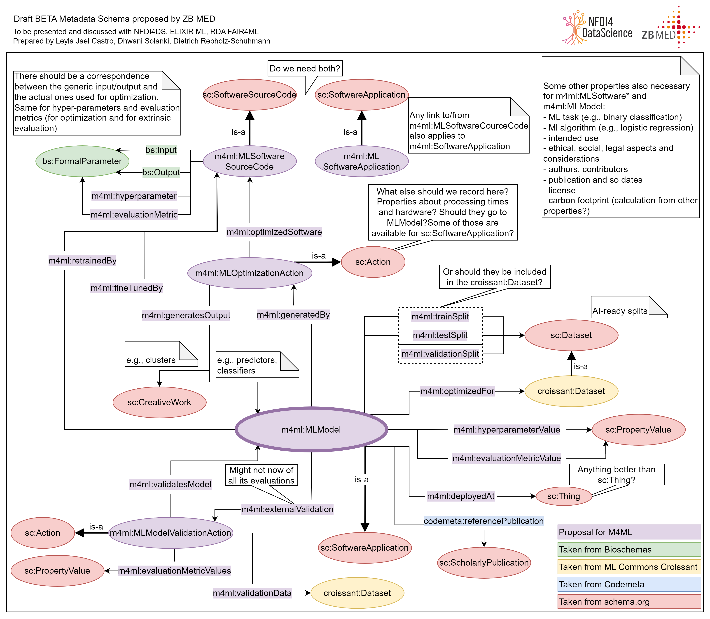

# Beta draft proposal for discussion

Here we presented a beta draft proposal prepared by ZB MED to be presented to the community at the beginning of 2024 for discussion. This beta draft is not intended for use yet but for discussions, harmonization and improvment before being officially released.

Types and properties can be visualized in the Data Discovery Engine (DDE) at https://discovery.biothings.io/view/m4ml/.

Here we also include usage recommendation, see https://discovery.biothings.io/view/m4mlProfiles, particularly for the ML model type

<table>
    <tr>
        <td>Source</td>
        <td>Property</td>
        <td>Range</td>
        <td>Decription</td>
        <td>Requirement</td>
        <td>Cardinality</td>
    </tr>
    <tr>
        <td>m4ml</td>
        <td>ethicalLegalSocial</td>
        <td>Text</td>
        <td>&quot;Considerations wrt ethical, legal and social aspects.&quot;</td>
        <td>minimum</td>
        <td>one</td>
    </tr>
    <tr>
        <td>m4ml</td>
        <td>evaluationMetricValue</td>
        <td>PropertyValue</td>
        <td>Evaluation metric values obtained when creating this ML model. There should be a correspondence with the evaluation metrics declared by the ML software used to create this ML model.</td>
        <td>minimum</td>
        <td>many</td>
    </tr>
    <tr>
        <td>m4ml</td>
        <td>generatedBy</td>
        <td>MLOptimizationAction</td>
        <td>Optimization action on an ML software used to create this ML model.</td>
        <td>minimum</td>
        <td>one</td>
    </tr>
    <tr>
        <td>m4ml</td>
        <td>hyperparameterValue</td>
        <td>PropertyValue</td>
        <td>Hyperparameter values used to create this ML model. There should be a correspondence with the hyperparameters declared by the ML software used to create this ML model.</td>
        <td>minimum</td>
        <td>many</td>
    </tr>
    <tr>
        <td>m4ml</td>
        <td>intendedUse</td>
        <td>Text or DefinedTerm or URL</td>
        <td>&quot;Purpose and intended use stated to enable users to make a decision as to the suitability of this creative work (e.g., lab protocol, machine learning model, software) to their experimental problem or own use case.&quot;</td>
        <td>minimum</td>
        <td>one</td>
    </tr>
    <tr>
        <td>m4ml</td>
        <td>mlAlgorithm</td>
        <td>Text or DefinedTerm</td>
        <td>ML algorithm used to solve the task. For instance logistic regression or random forests.</td>
        <td>minimum</td>
        <td>one</td>
    </tr>
    <tr>
        <td>m4ml</td>
        <td>mlTask</td>
        <td>Text or DefinedTerm</td>
        <td>ML task addressed by this Ml software or model. For instance binary classification.</td>
        <td>minimum</td>
        <td>one</td>
    </tr>
    <tr>
        <td>m4ml</td>
        <td>optimizedFor</td>
        <td>Dataset</td>
        <td>AI-ready dataset (after pre-processing) used by the ML software for the training and optimization of this ML model.</td>
        <td>minimum</td>
        <td>one</td>
    </tr>
    <tr>
        <td>schema</td>
        <td>author</td>
        <td>Organization or Person</td>
        <td>The author of this content or rating. Please note that author is special in that HTML 5 provides a special mechanism for indicating authorship via the rel tag. That is equivalent to this and may be used interchangeably.</td>
        <td>minimum</td>
        <td>many</td>
    </tr>
    <tr>
        <td>schema</td>
        <td>description</td>
        <td>Text or TextObject</td>
        <td>A description of the item.</td>
        <td>minimum</td>
        <td>one</td>
    </tr>
    <tr>
        <td>schema</td>
        <td>name</td>
        <td>Text</td>
        <td>The name of the item.</td>
        <td>minimum</td>
        <td>one</td>
    </tr>
    <tr>
        <td>schema</td>
        <td>url</td>
        <td>URL</td>
        <td>URL of the item.</td>
        <td>minimum</td>
        <td>many</td>
    </tr>
    <tr>
        <td>codemeta</td>
        <td>developmentStatus</td>
        <td>Text</td>
        <td>&quot;Description of development status, e.g. Active, inactive, suspended. See &lt;a href=&#39;http://www.repostatus.org/&#39; target=&#39;_blank&#39;&gt;repostatus.org&lt;/a&gt;&quot;</td>
        <td>recommended</td>
        <td>one</td>
    </tr>
    <tr>
        <td>codemeta</td>
        <td>readme</td>
        <td>URL</td>
        <td>Link to software Readme file.</td>
        <td>recommended</td>
        <td>one</td>
    </tr>
    <tr>
        <td>codemeta</td>
        <td>referencePublication</td>
        <td>ScholarlyArticle</td>
        <td>An academic publication related to the software.</td>
        <td>recommended</td>
        <td>one</td>
    </tr>
    <tr>
        <td>m4ml</td>
        <td>externalValidation</td>
        <td>m4ml:MLModelValidationAction</td>
        <td>&quot;A validation action using this ML model with an external validation dataset (e.g., when new datasets are produced from experiments and were not used as part of the learning process of this ML model). There could be external validations that this ML model is not aware of (e.g., done by third-parties).&quot;</td>
        <td>recommended</td>
        <td>many</td>
    </tr>
    <tr>
        <td>schema</td>
        <td>archivedAt</td>
        <td>URL or WebPage</td>
        <td>&quot;Indicates a page or other link involved in archival of a [[CreativeWork]]. In the case of [[MediaReview]], the items in a [[MediaReviewItem]] may often become inaccessible, but be archived by archival, journalistic, activist, or law enforcement organizations. In such cases, the referenced page may not directly publish the content.&quot;</td>
        <td>recommended</td>
        <td>many</td>
    </tr>
    <tr>
        <td>schema</td>
        <td>citation</td>
        <td>CreativeWork or Text</td>
        <td>&quot;A citation or reference to another creative work, such as another publication, web page, scholarly article, etc.&quot;</td>
        <td>recommended</td>
        <td>many</td>
    </tr>
    <tr>
        <td>schema</td>
        <td>funding</td>
        <td>Grant</td>
        <td>A Grant that directly or indirectly provide funding or sponsorship for this item. See also ownershipFundingInfo. Inverse property: fundedItem</td>
        <td>recommended</td>
        <td>many</td>
    </tr>
    <tr>
        <td>schema</td>
        <td>identifier</td>
        <td>PropertyValue or Text or URL</td>
        <td>&quot;The identifier property represents any kind of identifier for any kind of [[Thing]], such as ISBNs, GTIN codes, UUIDs etc. Schema.org provides dedicated properties for representing many of these, either as textual strings or as URL (URI) links. See [background notes](/docs/datamodel.html#identifierBg) for more details.\n        &quot;</td>
        <td>recommended</td>
        <td>many</td>
    </tr>
    <tr>
        <td>schema</td>
        <td>keywords</td>
        <td>DefinedTerm  or Text  or URL</td>
        <td>Keywords or tags used to describe this content. Multiple entries in a keywords list are typically delimited by commas.</td>
        <td>recommended</td>
        <td>many</td>
    </tr>
    <tr>
        <td>schema</td>
        <td>license</td>
        <td>CreativeWork or URL</td>
        <td>&quot;A license document that applies to this content, typically indicated by URL.&quot;</td>
        <td>recommended</td>
        <td>one</td>
    </tr>
    <tr>
        <td>schema</td>
        <td>releaseNotes</td>
        <td>Text or URL</td>
        <td>Description of what changed in this version.</td>
        <td>recommended</td>
        <td>one</td>
    </tr>
    <tr>
        <td>schema</td>
        <td>sameAs</td>
        <td>URL</td>
        <td>&quot;URL of a reference Web page that unambiguously indicates the item&#39;s identity. E.g. the URL of the item&#39;s Wikipedia page, Wikidata entry, or official website.&quot;</td>
        <td>recommended</td>
        <td>many</td>
    </tr>
    <tr>
        <td>schema</td>
        <td>softwareVersion</td>
        <td>Text</td>
        <td>Version of the software instance.</td>
        <td>recommended</td>
        <td>one</td>
    </tr>
    <tr>
        <td>codemeta</td>
        <td>buildInstructions</td>
        <td>URL</td>
        <td>Link to installation instructions/documentation.</td>
        <td>optional</td>
        <td>many</td>
    </tr>
    <tr>
        <td>codemeta</td>
        <td>contIntegration</td>
        <td>URL</td>
        <td>Link to continuous integration service.</td>
        <td>optional</td>
        <td>many</td>
    </tr>
    <tr>
        <td>codemeta</td>
        <td>embargoDate</td>
        <td>Date</td>
        <td>&quot;Software may be embargoed from public access until a specified date (e.g. pending publication, 1 year from publication).&quot;</td>
        <td>optional</td>
        <td>one</td>
    </tr>
    <tr>
        <td>codemeta</td>
        <td>issueTracker</td>
        <td>URL</td>
        <td>Link to software bug reporting or issue tracking system.</td>
        <td>optional</td>
        <td>many</td>
    </tr>
    <tr>
        <td>m4ml</td>
        <td>deployedAt</td>
        <td>Thing</td>
        <td>&quot;Platform, website, webservice or similar where this ML model has been deployed. There could be deployments that this ML model is not aware of (e.g., done by third-parties).&quot;</td>
        <td>optional</td>
        <td>many</td>
    </tr>
    <tr>
        <td>m4ml</td>
        <td>fineTunedBy</td>
        <td>SoftwareApplication or SoftwareSourceCode</td>
        <td>ML Software fine-tuning this ML model.</td>
        <td>optional</td>
        <td>many</td>
    </tr>
    <tr>
        <td>m4ml</td>
        <td>retrainedBy</td>
        <td>SoftwareApplication or SoftwareSourceCode</td>
        <td>ML software used to re-train this ML model.</td>
        <td>optional</td>
        <td>many</td>
    </tr>
    <tr>
        <td>schema</td>
        <td>conditionsOfAccess</td>
        <td>Text</td>
        <td>&quot;Conditions that affect the availability of, or method(s) of access to, an item. Typically used for real world items such as an [[ArchiveComponent]] held by an [[ArchiveOrganization]]. This property is not suitable for use as a general Web access control mechanism. It is expressed only in natural language.\\n\\nFor example \&quot;&quot;Available by appointment from the Reading Room\&quot;&quot; or \&quot;&quot;Accessible only from logged-in accounts \&quot;&quot;. &quot;</td>
        <td>optional</td>
        <td>many</td>
    </tr>
    <tr>
        <td>schema</td>
        <td>contributor</td>
        <td>Organization or Person</td>
        <td>A secondary contributor to the CreativeWork or Event.</td>
        <td>optional</td>
        <td>many</td>
    </tr>
    <tr>
        <td>schema</td>
        <td>copyrightHolder</td>
        <td>Organization or Person</td>
        <td>The party holding the legal copyright to the CreativeWork.</td>
        <td>optional</td>
        <td>many</td>
    </tr>
    <tr>
        <td>schema</td>
        <td>dateModified</td>
        <td>Date or DateTime</td>
        <td>The date on which the CreativeWork was most recently modified or when the item&#39;s entry was modified within a DataFeed.</td>
        <td>optional</td>
        <td>one</td>
    </tr>
    <tr>
        <td>schema</td>
        <td>datePublished</td>
        <td>Date or DateTime</td>
        <td>Date of first broadcast/publication.</td>
        <td>optional</td>
        <td>one</td>
    </tr>
    <tr>
        <td>schema</td>
        <td>discussionUrl</td>
        <td>URL</td>
        <td>A link to the page containing the comments of the CreativeWork.</td>
        <td>optional</td>
        <td>many</td>
    </tr>
    <tr>
        <td>schema</td>
        <td>installUrl</td>
        <td>URL</td>
        <td>&quot;URL at which the app may be installed, if different from the URL of the item.&quot;</td>
        <td>optional</td>
        <td>many</td>
    </tr>
    <tr>
        <td>schema</td>
        <td>isAccessibleForFree</td>
        <td>Boolean</td>
        <td>&quot;A flag to signal that the item, event, or place is accessible for free.&quot;</td>
        <td>optional</td>
        <td>one</td>
    </tr>
    <tr>
        <td>schema</td>
        <td>maintainer</td>
        <td>Organization or Person</td>
        <td>&quot;A maintainer of a [[Dataset]], software package ([[SoftwareApplication]]), or other [[Project]]. A maintainer is a [[Person]] or [[Organization]] that manages contributions to, and/or publication of, some (typically complex) artifact. It is common for distributions of software and data to be based on \&quot;&quot;upstream\&quot;&quot; sources. When [[maintainer]] is applied to a specific version of something e.g. a particular version or packaging of a [[Dataset]], it is always  possible that the upstream source has a different maintainer. The [[isBasedOn]] property can be used to indicate such relationships between datasets to make the different maintenance roles clear. Similarly in the case of software, a package may have dedicated maintainers working on integration into software distributions such as Ubuntu, as well as upstream maintainers of the underlying work.\n      &quot;</td>
        <td>optional</td>
        <td>many</td>
    </tr>
    <tr>
        <td>schema</td>
        <td>memoryRequirements</td>
        <td>Text or URL</td>
        <td>Minimum memory requirements.</td>
        <td>optional</td>
        <td>many</td>
    </tr>
    <tr>
        <td>schema</td>
        <td>operatingSystem</td>
        <td>Text</td>
        <td>&quot;Operating systems supported (Windows 7, OSX 10.6, Android 1.6).&quot;</td>
        <td>optional</td>
        <td>many</td>
    </tr>
    <tr>
        <td>schema</td>
        <td>processorRequirements</td>
        <td>Text</td>
        <td>Processor architecture required to run the application (e.g. IA64).</td>
        <td>optional</td>
        <td>many</td>
    </tr>
    <tr>
        <td>schema</td>
        <td>softwareHelp</td>
        <td>CreativeWork</td>
        <td>Software application help.</td>
        <td>optional</td>
        <td>many</td>
    </tr>
    <tr>
        <td>schema</td>
        <td>softwareRequirements</td>
        <td>Text or URL</td>
        <td>&quot;Component dependency requirements for application. This includes runtime environments and shared libraries that are not included in the application distribution package, but required to run the application (Examples: DirectX, Java or .NET runtime).&quot;</td>
        <td>optional</td>
        <td>many</td>
    </tr>
    <tr>
        <td>schema</td>
        <td>storageRequirements</td>
        <td>Text or URL</td>
        <td>Storage requirements (free space required).</td>
        <td>optional</td>
        <td>many</td>
    </tr>
</table>
